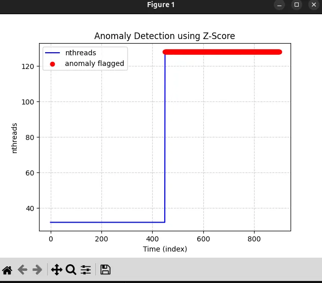

# Monitoring-and-Anomaly-detection
  Process resource monitoring and anomaly detection by analyzing time-series data generated with prmon. By statistical method (Z-Score)

## Setting up (Linux)

### Install dependencies
```bash
sudo apt update
sudo apt install -y \
    git cmake g++ \
    nlohmann-json3-dev \
    libspdlog-dev \
    python3 python3-pip
```

```bash
pip3 install -r requirements.txt
```

### Clone this prmon repo: [prmon](https://github.com/HSF/prmon)

```bash
git clone --recurse-submodules https://github.com/HSF/prmon.git
cd prmon
```
### Build and run:
```bash
mkdir build && cd build

cmake -DCMAKE_INSTALL_PREFIX=$HOME/prmon-install -S .. -B .

make -j$(nproc)

make install
```

### Add to path
```bash
echo 'export PATH="$HOME/prmon-install/bin:$PATH"' >> ~/.bashrc
source ~/.bashrc
```

## Generate Dataset using Prmon/burner

p: Number of Processes \
t: Number of Threads \
r: Time in seconds 

### First set
```bash
prmon \
  --filename prmon_normal.txt \
  --interval 1 \
  -- /path/burner -p 4 -t 8 -r 900
```

### Anomaly Set

```bash
prmon \
  --filename prmon_normal_1.txt \
  --interval 1 \
  -- /path/burner -p 8 -t 16 -r 900
```

## Statistical approach

As data didn't have much noise, moving with Z-Score is an Optimal approach. -> [Reference](https://medium.com/booking-com-development/anomaly-detection-in-time-series-using-statistical-analysis-cc587b21d008)

> Concatinated both dataset.

Calculated Z-Scores with reference to `nthreads`. 
```py
df['z_score'] = (df['nthreads'] - df['nthreads'].mean()) / df['nthreads'].std()
```

#### `nthreads` reflects the changes between two datasets when we doubled threads from 8 to 16.

> IQR (Interquartile Range) was considered but Z-score was sufficient given the clean, controlled nature of the data with no outliers skewing the mean.



#### Threshold 0.5
----
### Why Z-score

> Z-score is the number of standard deviation by which the value of raw score is above or below the mean of what was observed. Raw scores above mean have positive standard deviation where as the ones below have negative

To summarize: Z-score measure how far is a particular data point from mean. It provoides a straight forward way to detect anomalies is time-series data

> The Interquartile Range (IQR) is a measure of statistical dispersion that represents the spread of the middle 50% of a data set, calculated by subtracting the first quartile (Q1) from the third quartile (Q3). It highlights where the bulk of the values lie, making it a robust, outlier-resistant alternative to the full range

As the two levels were so distinctly separated that any threshold-based method would work. IQR's robostness would be unnecessary.
#
